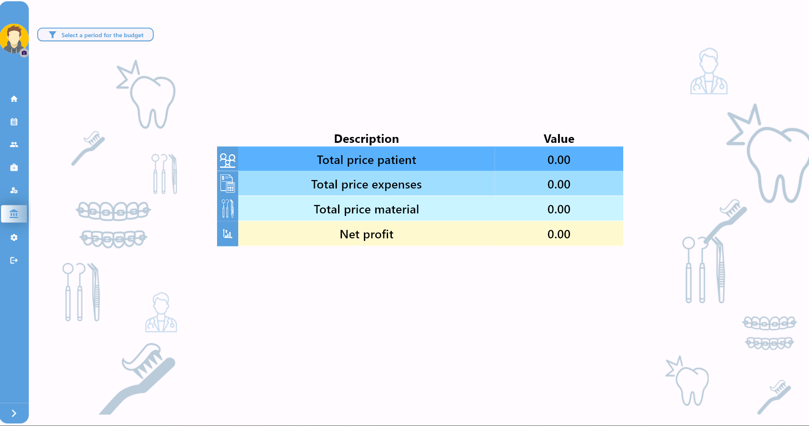

# dental_app

<!-- Features -->
<h2 align="center"> 🚀 Health care </h2>
The clinic management program is an integrated solution that works across all platforms (Desktop, Mobile, Web) to efficiently manage every aspect of a dental clinic. The program provides the following features:

### Key Features

#### 1. Patient File Management

Manage patient records comprehensively, including medical history, payments (paid and remaining), and session details. Track treatment progress, view past procedures, and monitor outstanding costs with ease.

#### 2. Operation Management

Create predefined procedures (e.g., nerve filling) with fixed prices that can be added during session creation. Analyze the number and cost of operations performed, and easily track operation statistics.

#### 3. Inventory Management

Monitor inventory in real-time to keep track of available materials and medications nearing expiration. Stay informed of inventory changes to avoid shortages of essential items.

#### 4. Clinic Expense Management

Track all clinic expenses, from utility bills to wages and miscellaneous costs (e.g., food, drinks). Record and manage expenses flexibly and accurately.

#### 5. Budget Management

Generate a comprehensive budget, factoring in expenses and medication costs during a specific period. This allows you to calculate net profit by subtracting expenses from revenue, giving a clear financial overview.

The clinic management program is the ideal solution for dentists seeking to manage their clinics efficiently while delivering high-quality services to patients.

<!-- Project Screenshots -->
<h2 align="center">📸 Project Screenshots 📸</h2>

   
    
    
   
    
    
    
    
     
    
    
  <!-- Add more screenshots... -->

<!-- Technologies Used -->
<h2 align="center">💡 Technologies Used</h2>

Built using cutting-edge technologies:

<ul>
  <li>Dart & Flutter</li>
  <li>firebase</li>
  <li>Hive Local Database</li>
  <li>Getx State Management</li>
  <!-- Add more technologies... -->
</ul>
